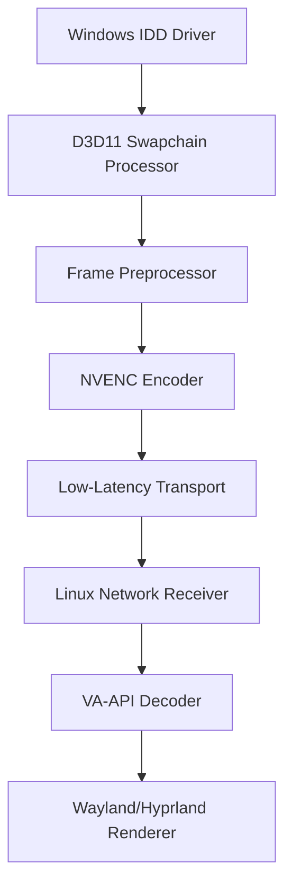

# LumaBridge Display - Documento de Requisitos e Plano de Desenvolvimento

## 1. Visão geral

O LumaBridge Display é uma aplicação multiplataforma para transformar um dispositivo secundário, inicialmente um laptop Linux com Arch Linux + Hyprland, em um monitor virtual reconhecido pelo Windows 11 como uma tela real adicional.

O objetivo não é apenas espelhar ou transmitir a tela principal. O objetivo é criar um monitor virtual no Windows, permitir que o usuário estenda a área de trabalho para esse monitor e transmitir o conteúdo desse display virtual para o cliente Linux com baixa latência, boa qualidade visual e suporte a entrada remota opcional.

## 2. Nome do projeto

Nome comercial escolhido: **LumaBridge Display**

Justificativa: o nome comunica ponte visual entre dispositivos, é curto, memorável e não restringe o produto a Windows/Linux, permitindo expansão futura para macOS, Android ou tablets.

## 3. Objetivos do produto

### 3.1 Objetivo principal

Desenvolver uma aplicação capaz de fazer um computador Windows 11 reconhecer outro dispositivo na rede como monitor secundário virtual, transmitindo os frames desse monitor para o cliente Linux com baixa latência.

### 3.2 Objetivos específicos

- Criar um monitor virtual no Windows usando o modelo oficial de Indirect Display Driver.
- Capturar frames do monitor virtual sem depender de screen capture genérico da tela principal.
- Codificar os frames no host Windows usando aceleração de hardware por NVENC quando disponível.
- Transmitir o fluxo de vídeo pela rede local com baixa latência.
- Decodificar o vídeo no cliente Linux usando aceleração de hardware pela Intel iGPU via VA-API quando disponível.
- Renderizar o stream em tela cheia no Wayland/Hyprland.
- Permitir configuração de resolução, FPS, codec, bitrate e modo de qualidade/latência.
- Implementar pareamento seguro entre host e cliente.
- Manter fluxo profissional com GitHub Issues, Pull Requests, branch `dev` como integração e `main` apenas para release funcional final.

## 4. Escopo inicial

### 4.1 Plataformas suportadas no MVP

Host:

- Windows 11.
- GPU NVIDIA RTX 3060 Ti.
- Driver NVIDIA atualizado.
- Suporte prioritário a NVENC H.264 e HEVC/H.265.

Cliente:

- Arch Linux.
- Hyprland/Wayland.
- GPU integrada Intel.
- Decode por VA-API quando suportado.

Rede:

- LAN cabeada ou Wi-Fi 5 GHz/6 GHz.
- Primeira versão focada em rede local.
- Conexão pela internet, NAT traversal e relay ficam fora do MVP.

### 4.2 Fora do escopo do MVP

- Streaming pela internet com relay próprio.
- Cliente Android/iOS.
- Suporte completo a macOS.
- HDR.
- Áudio multicanal.
- Múltiplos monitores virtuais simultâneos.
- Instalador assinado para distribuição pública.
- Driver assinado para produção.
- Modo colaborativo multiusuário.
- Compatibilidade com jogos protegidos por anti-cheat.

## 5. Tecnologias verificadas e stack recomendado

### 5.1 Driver virtual no Windows

Tecnologia recomendada:

- Microsoft Indirect Display Driver Model.
- IddCx (Indirect Display Driver Class Extension).
- UMDF (User-Mode Driver Framework).
- Windows Driver Kit (WDK).
- C++17 ou C++20.
- Direct3D 11 como primeira opção.

Base técnica:

- O modelo IDD é indicado pela Microsoft para cenários de monitores não conectados fisicamente, incluindo streaming remoto e monitores virtuais.
- O driver IDD deve criar adaptador, monitor, modos de vídeo e processar swapchains recebidas do sistema.
- O sample oficial da Microsoft, IddSample, deve ser usado como ponto de partida.

Referências:

- https://learn.microsoft.com/nb-no/windows-hardware/drivers/display/indirect-display-driver-model-overview
- https://learn.microsoft.com/de-de/samples/microsoft/windows-driver-samples/indirect-display-driver-sample/

### 5.2 Captura e pipeline gráfico no host

Tecnologias:

- Direct3D 11.
- DXGI.
- ID3D11Texture2D.
- Sincronização por fence/evento quando necessário.
- Conversão RGB/BGRA para NV12/P010 preferencialmente na GPU.

Diretriz:

- Evitar cópia GPU -> CPU -> GPU.
- Priorizar pipeline GPU -> encoder.
- Medir cada etapa do pipeline desde frame entregue pelo driver até envio pela rede.

### 5.3 Encode de vídeo no Windows

Tecnologia recomendada:

- NVIDIA Video Codec SDK.
- NVENC.
- H.264 para compatibilidade.
- HEVC/H.265 para melhor qualidade por bitrate, caso o cliente decodifique bem.

Configuração inicial recomendada:

- Preset: low latency ou ultra low latency.
- Rate control: CBR ou CBR low delay.
- B-frames: 0 inicialmente.
- Lookahead: desativado.
- VBV buffer: muito baixo, idealmente próximo a 1 frame.
- GOP: curto ou infinito, conforme comportamento medido.
- FPS alvo: 60.

Observação importante:

- A RTX 3060 Ti suporta NVENC para H.264 e HEVC. Encode AV1 não deve ser requisito do MVP, pois AV1 encode é típico das gerações NVIDIA mais recentes, como RTX 40.

Referências:

- https://docs.nvidia.com/video-technologies/video-codec-sdk/13.0/nvenc-video-encoder-api-prog-guide/index.html
- https://developer.nvidia.com/video-codec-sdk

### 5.4 Transporte de rede

Opções avaliadas:

1. UDP customizado.
2. QUIC.
3. WebRTC nativo.
4. RTP sobre UDP.

Escolha recomendada para o MVP:

- Implementar primeiro um transporte LAN simples com UDP/RTP ou QUIC.
- Evitar TCP puro para vídeo interativo, pois retransmissão bloqueante piora latência.

Escolha recomendada para evolução:

- WebRTC nativo se o projeto precisar futuramente de NAT traversal, criptografia padronizada, jitter buffer, congestion control e suporte mais amplo.
- QUIC se o projeto quiser controle maior do protocolo sem carregar todo o peso do WebRTC.

Diretriz:

- O MVP deve funcionar em LAN sem servidor externo.
- Todo pacote de vídeo deve ter timestamp, número de sequência e identificador de frame.
- O cliente deve descartar frames atrasados em vez de acumular fila.

### 5.5 Decode no Linux

Tecnologia recomendada:

- FFmpeg/libavcodec com VA-API.
- Alternativa: GStreamer com VA-API.
- Render via EGL/OpenGL, Vulkan, SDL2 ou wgpu.

Diretriz:

- Usar decode por hardware na Intel iGPU via VA-API quando disponível.
- Ter fallback para decode por software apenas para diagnóstico, não como modo recomendado.

Referência:

- https://www.intel.com/content/www/us/en/developer/articles/technical/linuxmedia-vaapi.html

### 5.6 Render no Linux/Hyprland

Tecnologias possíveis:

- Wayland client nativo.
- SDL2 com backend Wayland.
- GLFW/EGL.
- wgpu.
- Vulkan.

Escolha recomendada para MVP:

- SDL2 + OpenGL/EGL ou wgpu, priorizando simplicidade e janela fullscreen confiável no Hyprland.

Requisitos:

- Janela fullscreen borderless.
- Vsync configurável.
- Modo baixa latência com fila mínima de frames.
- Exibição de overlay opcional com FPS, bitrate, decode time, network jitter e end-to-end latency estimada.

### 5.7 Entrada remota

MVP:

- Input remoto opcional.
- O produto deve funcionar como monitor secundário mesmo sem input remoto.

Evolução:

- Mouse e teclado do cliente Linux injetados no Windows.
- Windows: SendInput para input sintético.
- Linux: captura via libinput/Wayland quando permitido.
- Gamepad: ViGEmBus ou alternativa moderna compatível.

Risco:

- Wayland restringe captura global de teclado/mouse por segurança. No Hyprland, pode ser necessário suporte específico, portal ou configuração do compositor.

### 5.8 Áudio

MVP:

- Fora do escopo.

Evolução:

- Captura por WASAPI loopback no Windows.
- Codec Opus.
- Sincronização independente do vídeo, com buffer pequeno.

### 5.9 Interface gráfica

Host Windows:

- UI simples para iniciar/parar host, selecionar resolução/FPS/codec/bitrate e parear cliente.
- Opções: Qt, Tauri, .NET/WPF, WinUI 3.

Cliente Linux:

- UI simples para listar hosts LAN, conectar e configurar fullscreen.
- Opções: Qt, GTK, Tauri, SDL2 com tela de configuração própria.

Escolha recomendada:

- Separar core em C++/Rust e UI fina.
- Para MVP, CLI + arquivo de configuração é aceitável; UI pode ser um épico posterior.

### 5.10 Linguagem e organização técnica

Escolha recomendada:

- C++ para driver Windows e integração direta com Direct3D/NVENC.
- Rust ou C++ para protocolo/core multiplataforma.
- C++ no MVP reduz atrito com WDK, Direct3D, NVENC e bibliotecas nativas.

Opção pragmática:

- Driver e host core: C++.
- Linux client: C++ com FFmpeg/VA-API/SDL2.
- Futuramente, UI em Tauri ou Qt.

### 5.11 Toolchain de desenvolvimento

Windows:

- Visual Studio 2022.
- Windows SDK.
- Windows Driver Kit (WDK).
- CMake.
- Ninja.
- vcpkg ou Conan para dependências C++.
- NVIDIA Video Codec SDK.
- Driver NVIDIA atualizado.

Linux/Arch:

- GCC ou Clang.
- CMake.
- Ninja.
- pkg-config.
- FFmpeg development libraries.
- libva.
- intel-media-driver.
- SDL2 ou biblioteca de render escolhida.
- Wayland development libraries, se cliente Wayland nativo for usado.

Qualidade:

- clang-format.
- clang-tidy.
- sanitizers em Linux quando possível.
- GitHub Actions com runners Linux e Windows.
- Test framework: Catch2, GoogleTest ou doctest.

### 5.12 Dependências externas permitidas

Permitidas no MVP:

- FFmpeg/libavcodec.
- libva.
- SDL2, GLFW ou wgpu.
- spdlog ou biblioteca equivalente de logs.
- tomlplusplus, yaml-cpp ou nlohmann/json para configuração.
- mDNS/Zeroconf library, se descoberta LAN for implementada cedo.

Não permitidas no MVP:

- Código copiado de projetos proprietários.
- Reverse engineering de Parsec ou de qualquer software proprietário.
- Criptografia implementada manualmente sem biblioteca consolidada.
- Dependência obrigatória de serviço externo.

### 5.13 Projetos de referência conceitual

Estes projetos podem ser estudados como referência conceitual, sem copiar código incompatível com a licença:

- Microsoft IddSample: referência oficial para driver IDD.
- Sunshine/Moonlight: referência conceitual para streaming de baixa latência.
- Looking Glass: referência conceitual de pipeline de baixa latência, embora o cenário principal seja VM/shared memory.
- spacedesk: referência conceitual de produto de monitor virtual em rede.

## 6. Arquitetura alvo



### 6.1 Componentes principais

1. `lumabridge-idd-driver`
   - Driver UMDF/IddCx.
   - Cria monitor virtual.
   - Expõe modos de vídeo configuráveis.
   - Entrega frames via swapchain para processamento.

2. `lumabridge-host`
   - Serviço/aplicação Windows.
   - Controla sessão, pareamento e configuração.
   - Recebe frames do driver ou do processador de swapchain.
   - Codifica via NVENC.
   - Envia stream pela rede.

3. `lumabridge-client`
   - Aplicação Linux.
   - Descobre host na LAN.
   - Recebe stream.
   - Decodifica via VA-API.
   - Renderiza em fullscreen no Hyprland.

4. `lumabridge-protocol`
   - Biblioteca compartilhada.
   - Define mensagens, handshake, controle, estatísticas, timestamps, frames e input.

5. `lumabridge-tools`
   - Ferramentas de diagnóstico.
   - Medidores de latência.
   - Testes de rede.
   - Validação de encode/decode.

## 7. Requisitos funcionais

### RF-001 - Criar monitor virtual no Windows

O sistema deve criar um monitor virtual reconhecido pelo Windows 11 como display adicional.

Critérios de aceite:

- O monitor aparece em Configurações do Windows > Sistema > Tela.
- O usuário consegue usar modo "Estender estes vídeos".
- O monitor possui resolução e taxa de atualização configuráveis.
- O monitor pode ser conectado e desconectado sem reiniciar o Windows, quando tecnicamente possível.

### RF-002 - Configurar modos de vídeo

O host deve permitir modos de vídeo predefinidos.

Modos mínimos:

- 1280x720 @ 60 Hz.
- 1920x1080 @ 60 Hz.
- 2560x1440 @ 60 Hz, se suportado pela rede e cliente.

Critérios de aceite:

- O modo selecionado é refletido no Windows.
- O cliente Linux ajusta a janela ao modo recebido.

### RF-003 - Capturar frames do monitor virtual

O host deve processar os frames renderizados pelo Windows para o monitor virtual.

Critérios de aceite:

- O conteúdo exibido no cliente corresponde ao monitor virtual.
- Não deve capturar a tela física principal por engano.
- Deve haver contador de frames processados.

### RF-004 - Codificar vídeo com NVENC

O host deve codificar frames usando NVENC quando a RTX 3060 Ti estiver disponível.

Critérios de aceite:

- O sistema detecta suporte a NVENC.
- O stream usa H.264 no modo inicial.
- HEVC pode ser ativado por configuração.
- O sistema mostra erro claro se NVENC não estiver disponível.

### RF-005 - Transmitir stream em baixa latência

O host deve transmitir frames para o cliente em LAN.

Critérios de aceite:

- O cliente recebe frames continuamente.
- O protocolo identifica perda, atraso e ordem de pacotes.
- Frames muito atrasados são descartados.
- A sessão não deve travar por perda temporária de pacote.

### RF-006 - Decodificar vídeo no Linux com VA-API

O cliente deve usar VA-API quando disponível.

Critérios de aceite:

- O cliente informa se está usando hardware decode.
- O uso de CPU permanece baixo em 1080p60 em condições normais.
- Fallback por software existe apenas para diagnóstico.

### RF-007 - Renderizar em fullscreen no Hyprland

O cliente deve renderizar o stream em uma janela fullscreen.

Critérios de aceite:

- A janela abre em fullscreen.
- O frame não fica esticado de forma incorreta.
- O usuário pode sair com atalho configurável.
- O cliente não deve depender de X11.

### RF-008 - Pareamento entre host e cliente

O sistema deve impedir conexões acidentais ou não autorizadas na LAN.

Critérios de aceite:

- O host exibe um código de pareamento.
- O cliente informa o código na primeira conexão.
- Após pareamento, uma chave local é armazenada.
- O usuário pode revogar clientes pareados.

### RF-009 - Descoberta LAN

O cliente deve conseguir encontrar hosts LumaBridge na rede local.

Critérios de aceite:

- Descoberta por mDNS/Zeroconf ou broadcast UDP.
- O usuário também pode informar IP manualmente.
- A conexão manual funciona mesmo se descoberta automática falhar.

### RF-010 - Estatísticas de sessão

O sistema deve apresentar estatísticas básicas.

Métricas mínimas:

- FPS.
- Bitrate.
- Latência de encode.
- Latência de decode.
- Jitter estimado.
- Pacotes perdidos.
- Frames descartados.

### RF-011 - Encerramento seguro da sessão

O sistema deve encerrar sessão sem deixar estado inconsistente.

Critérios de aceite:

- Cliente pode desconectar.
- Host para envio de frames.
- Monitor virtual pode permanecer ativo ou ser removido, conforme configuração.
- Logs registram encerramento.

### RF-012 - Configuração persistente

O sistema deve salvar configurações básicas.

Configurações mínimas:

- Resolução.
- FPS.
- Codec.
- Bitrate.
- Host/IP preferido.
- Chaves de pareamento.

## 8. Requisitos não funcionais

### RNF-001 - Latência

Meta inicial:

- LAN cabeada 1080p60: latência fim-a-fim abaixo de 50 ms em condições boas.
- Wi-Fi bom: abaixo de 80 ms como meta inicial.

Meta avançada:

- Aproximar-se de 20-35 ms em LAN cabeada após otimizações.

### RNF-002 - Desempenho

- O host deve usar NVENC e evitar encode por CPU.
- O cliente deve usar VA-API e evitar decode por CPU.
- O pipeline deve evitar cópias desnecessárias GPU -> CPU.

### RNF-003 - Estabilidade

- Falha no cliente não deve derrubar o host.
- Falha no host não deve travar o Windows.
- Driver deve ser tratado como componente crítico e testado isoladamente.

### RNF-004 - Segurança

- Conexões devem ser autenticadas.
- Pareamento deve gerar segredo local.
- Futuramente, tráfego deve ser criptografado.
- Logs não devem expor chaves.

### RNF-005 - Observabilidade

- Logs estruturados.
- Níveis de log: error, warn, info, debug, trace.
- Métricas de pipeline por etapa.
- Modo diagnóstico para salvar relatório de sessão.

### RNF-006 - Manutenibilidade

- Componentes separados por responsabilidade.
- Código de protocolo independente de UI.
- Driver isolado do transporte de rede quando possível.
- Testes automatizados para protocolo e configuração.

### RNF-007 - Portabilidade futura

- O protocolo não deve assumir Linux como único cliente.
- O host deve ter contratos claros para permitir cliente Windows/macOS no futuro.

### RNF-008 - Usabilidade

- Usuário comum deve conseguir iniciar host, conectar cliente e usar como monitor sem editar arquivos manualmente na versão estável.
- No MVP, CLI é aceitável, mas mensagens de erro devem ser claras.

## 9. Requisitos de qualidade visual

- Texto deve ser legível em 1080p60.
- O stream não deve apresentar tearing perceptível em uso normal.
- O sistema deve oferecer perfis:
  - `low-latency`: menor fila, menor tolerância a artefatos.
  - `balanced`: qualidade maior com latência ainda aceitável.
  - `quality`: maior bitrate e qualidade, usado apenas quando a rede suporta.

## 10. Requisitos de compatibilidade com hardware do usuário

Host alvo:

- Windows 11.
- NVIDIA RTX 3060 Ti.
- NVENC H.264/HEVC.
- CPU suficiente para pipeline e rede.
- Preferencialmente Ethernet.

Cliente alvo:

- Arch Linux.
- Hyprland.
- Intel iGPU.
- Pacotes esperados:
  - `libva`
  - `intel-media-driver`
  - `ffmpeg`
  - `sdl2` ou stack equivalente
  - `vulkan-intel` se render Vulkan for usado

## 11. Estratégia de desenvolvimento

### 11.1 Branches

- `main`: branch protegida. Deve receber apenas a versão final funcional.
- `dev`: branch de integração temporária. Todo desenvolvimento entra nela por Pull Request.
- `feature/*`: branches de funcionalidade.
- `fix/*`: branches de correção.
- `spike/*`: branches de pesquisa técnica descartável ou experimental.
- `release/*`: branch de estabilização antes de merge final em `main`.

Regra:

- Nenhum commit direto em `main`.
- Nenhum commit direto em `dev`, exceto setup inicial se o repositório ainda estiver vazio.
- Toda alteração deve estar vinculada a uma issue.
- Todo Pull Request deve fechar ou referenciar issue.

### 11.2 Convenção de commits

Usar Conventional Commits:

- `feat(driver): add initial IddCx virtual monitor`
- `feat(host): add NVENC H264 encoder`
- `feat(client): add VA-API decoder`
- `fix(protocol): handle out-of-order packets`
- `test(protocol): add packet reordering tests`
- `docs: add architecture decision record for transport`

### 11.3 Pull Requests

Cada PR deve conter:

- Issue relacionada.
- Objetivo da mudança.
- Como testar.
- Riscos.
- Evidências: logs, screenshots ou métricas quando aplicável.

### 11.4 Política de granularidade

Separar commits por unidade lógica:

- Um commit para estrutura de projeto.
- Um commit para protocolo.
- Um commit para driver.
- Um commit para encode.
- Um commit para decode.
- Um commit para testes.
- Um commit para documentação.

Não misturar refatoração, feature e correção no mesmo commit.

## 12. Épicos e issues sugeridas

### Épico 1 - Fundação do repositório

Issue 1: Inicializar monorepo

- Criar estrutura de pastas.
- Adicionar README.
- Adicionar LICENSE.
- Adicionar CONTRIBUTING.
- Adicionar CODEOWNERS se houver equipe.
- Adicionar `.editorconfig`.
- Adicionar formatação.

Issue 2: Configurar CI inicial

- Build Linux client.
- Build Windows host quando runner Windows estiver disponível.
- Lint.
- Testes unitários.

Issue 3: Criar documentação de arquitetura

- ADR 001: escolha do driver IDD.
- ADR 002: escolha de NVENC.
- ADR 003: escolha inicial do transporte.

### Épico 2 - Protocolo e sessão

Issue 4: Definir protocolo de controle

- Handshake.
- Versão de protocolo.
- Capabilities.
- Configuração de vídeo.
- Start/stop session.

Issue 5: Definir formato de pacotes de vídeo

- Frame ID.
- Packet sequence.
- Timestamp.
- Fragmentação.
- Flags de keyframe.

Issue 6: Implementar testes do protocolo

- Serialização.
- Desserialização.
- Pacotes fora de ordem.
- Perda simulada.
- Rejeição de versão incompatível.

### Épico 3 - Driver virtual Windows

Issue 7: Criar driver baseado no IddSample

- Enumerar adaptador virtual.
- Enumerar um monitor virtual.
- Expor modo 1920x1080@60.

Issue 8: Implementar modos configuráveis

- 720p60.
- 1080p60.
- 1440p60.

Issue 9: Processar swapchain do monitor virtual

- Receber frames.
- Medir frame timing.
- Entregar textura para pipeline do host.

Issue 10: Criar instalador de desenvolvimento do driver

- Script de instalação em modo teste.
- Script de remoção.
- Documentar requisitos do WDK.

### Épico 4 - Host Windows

Issue 11: Criar serviço/aplicação host mínima

- CLI para iniciar/parar.
- Configuração por arquivo.
- Logs.

Issue 12: Integrar frames do driver ao host

- Receber textura D3D11.
- Medir latência de captura.
- Validar conteúdo renderizado.

Issue 13: Implementar encoder NVENC H.264

- Inicialização do encoder.
- Envio de textura.
- Recebimento de bitstream.
- Métricas de encode.

Issue 14: Implementar HEVC opcional

- Ativar por configuração.
- Negociar suporte com cliente.

Issue 15: Implementar envio de stream

- UDP/RTP ou QUIC.
- Fragmentação.
- Controle básico de sessão.

### Épico 5 - Cliente Linux

Issue 16: Criar cliente Linux mínimo

- CLI.
- Conexão por IP manual.
- Logs.

Issue 17: Receber stream

- Buffer mínimo.
- Reordenação limitada.
- Descarte de frames atrasados.

Issue 18: Decodificar H.264 via VA-API

- Detectar VA-API.
- Inicializar decode.
- Fallback software para diagnóstico.

Issue 19: Renderizar fullscreen no Hyprland

- Abrir janela fullscreen.
- Renderizar frames.
- Atalho para sair.

Issue 20: Implementar overlay de métricas

- FPS.
- Bitrate.
- Perda.
- Decode time.
- Queue depth.

### Épico 6 - Pareamento e segurança

Issue 21: Implementar descoberta LAN

- mDNS/Zeroconf ou UDP broadcast.
- Lista de hosts disponíveis.

Issue 22: Implementar pareamento por código

- Código temporário no host.
- Cliente envia código.
- Host gera segredo local.

Issue 23: Autenticar sessões pareadas

- Token assinado ou HMAC.
- Rejeitar cliente não pareado.

Issue 24: Criptografar tráfego

- DTLS, QUIC TLS ou camada criptográfica própria bem revisada.
- Não implementar criptografia caseira sem biblioteca confiável.

### Épico 7 - UX e empacotamento

Issue 25: Criar UI simples do host

- Status do driver.
- Status do cliente.
- Resolução/FPS/codec/bitrate.

Issue 26: Criar UI simples do cliente

- Lista de hosts.
- Botão conectar.
- Configuração fullscreen.

Issue 27: Criar scripts de instalação

- Windows host.
- Linux client.
- Arch Linux package script opcional.

Issue 28: Documentar setup do usuário

- Requisitos.
- Instalação.
- Solução de problemas.

### Épico 8 - Otimização

Issue 29: Medir latência fim-a-fim

- Timestamp host.
- Timestamp cliente.
- Overlay.
- Relatório.

Issue 30: Reduzir cópias de memória

- Mapear pontos de cópia.
- Remover cópias CPU desnecessárias.

Issue 31: Ajustar NVENC para baixa latência

- Testar presets.
- Testar bitrate.
- Testar VBV.
- Testar GOP.

Issue 32: Ajustar buffer do cliente

- Minimizar queue.
- Descartar frames atrasados.
- Melhorar frame pacing.

## 13. Roadmap recomendado

### Fase 0 - Spike técnico

Objetivo:

- Provar que cada parte crítica é viável isoladamente.

Entregas:

- Driver virtual enumerando monitor 1080p60.
- Host codificando uma textura sintética com NVENC.
- Cliente Linux decodificando sample H.264 com VA-API.
- Transporte local enviando frames sintéticos.

Critério de saída:

- Todas as tecnologias críticas funcionam isoladamente.

### Fase 1 - MVP integrado em LAN

Objetivo:

- Windows reconhece monitor virtual e cliente Linux exibe o conteúdo.

Entregas:

- Monitor virtual ativo.
- Stream H.264 1080p60.
- Cliente fullscreen.
- Configuração por arquivo.
- Logs e métricas básicas.

Critério de saída:

- O usuário consegue arrastar uma janela do Windows para o monitor virtual e vê-la no laptop Linux.

### Fase 2 - Baixa latência e qualidade

Objetivo:

- Aproximar experiência de produto usável.

Entregas:

- Otimização NVENC.
- Decode VA-API estável.
- Overlay de métricas.
- Descarte inteligente de frames.
- HEVC opcional.

Critério de saída:

- 1080p60 em LAN com latência aceitável para uso de desktop.

### Fase 3 - Segurança e UX

Objetivo:

- Tornar uso diário seguro e menos manual.

Entregas:

- Pareamento.
- Descoberta LAN.
- UI básica.
- Scripts de instalação.

Critério de saída:

- Usuário consegue configurar sem mexer manualmente em arquivos.

### Fase 4 - Release candidata

Objetivo:

- Preparar merge de `dev` para `main`.

Entregas:

- Documentação completa.
- Testes passando.
- Build reproduzível.
- Checklist de instalação.
- Release notes.

Critério de saída:

- `dev` pode ser mergeada em `main`.

## 14. Estrutura inicial do repositório

```text
lumabridge-display/
  README.md
  LICENSE
  CONTRIBUTING.md
  docs/
    architecture/
      ADR-001-indirect-display-driver.md
      ADR-002-video-encoding.md
      ADR-003-transport.md
    setup/
      windows-host.md
      arch-linux-client.md
    troubleshooting.md
  protocol/
    include/
    src/
    tests/
  windows/
    driver/
    host/
    installer/
  linux/
    client/
    packaging/
  tools/
    latency-tester/
    network-tester/
  scripts/
  .github/
    workflows/
    ISSUE_TEMPLATE/
    PULL_REQUEST_TEMPLATE.md
```

## 15. Critérios de pronto gerais

Uma issue só deve ser considerada concluída quando:

- Código implementado.
- Testes automatizados adicionados quando aplicável.
- Build local validado.
- Logs ou evidências anexadas ao PR.
- Documentação atualizada se comportamento, instalação ou arquitetura mudarem.
- PR revisado antes de merge em `dev`.

## 16. Testes necessários

### 16.1 Testes unitários

- Serialização do protocolo.
- Configuração.
- Fragmentação e remontagem de pacotes.
- Cálculo de bitrate e FPS.
- Controle de estado da sessão.

### 16.2 Testes de integração

- Host inicia e aceita conexão.
- Cliente conecta por IP.
- Handshake completo.
- Stream sintético enviado e renderizado.
- Perda simulada de pacotes.
- Reconexão após queda.

### 16.3 Testes manuais obrigatórios

- Windows lista monitor virtual.
- Modo estendido funciona.
- Janela arrastada para monitor virtual aparece no Linux.
- Cliente abre fullscreen no Hyprland.
- Desconexão não trava host.
- Remoção do driver não deixa dispositivo inválido.

### 16.4 Métricas de desempenho

Registrar em cada release candidata:

- FPS médio.
- FPS mínimo.
- Bitrate médio.
- Latência de encode.
- Latência de decode.
- Jitter.
- Uso de CPU host.
- Uso de GPU host.
- Uso de CPU cliente.
- Uso de GPU cliente.

## 17. Riscos técnicos

### Risco 1 - Driver virtual Windows

O driver IDD é a parte mais crítica. Sem ele, o Windows não reconhecerá o laptop como monitor real.

Mitigação:

- Começar com IddSample.
- Fazer spike isolado.
- Manter driver mínimo no início.

### Risco 2 - Assinatura de driver

Para desenvolvimento, modo de teste pode ser suficiente. Para distribuição pública, assinatura de driver é necessária.

Mitigação:

- Documentar modo de teste.
- Adiar assinatura para release pública.

### Risco 3 - Cópias excessivas de frame

Cópias GPU -> CPU podem destruir a latência.

Mitigação:

- Medir pipeline.
- Priorizar D3D11 texture -> NVENC.

### Risco 4 - VA-API inconsistente no cliente

Configuração de VA-API pode variar conforme geração da Intel e pacotes instalados.

Mitigação:

- Implementar diagnóstico claro.
- Documentar pacotes Arch.
- Manter fallback software para teste.

### Risco 5 - Rede Wi-Fi instável

Wi-Fi pode causar jitter e perda.

Mitigação:

- Otimizar para LAN cabeada primeiro.
- Implementar descarte de frames atrasados.
- Exibir métricas ao usuário.

### Risco 6 - Wayland restringe input

Captura/injeção global no Linux é mais restrita em Wayland.

Mitigação:

- Input remoto fora do MVP.
- Tratar display como primeira entrega.

## 18. Decisões técnicas iniciais

- O MVP deve focar em LAN.
- O primeiro codec deve ser H.264 por compatibilidade.
- HEVC deve ser implementado depois como melhoria.
- AV1 não deve ser requisito por causa da RTX 3060 Ti.
- WebRTC não deve ser obrigatório no MVP; pode ser complexo demais para a primeira entrega.
- O driver IDD deve ser desenvolvido antes de qualquer UI sofisticada.
- A UI não deve mascarar falhas de pipeline; logs e métricas vêm antes de design visual.

## 19. Primeira sequência de trabalho para a IA implementadora

1. Criar repositório vazio.
2. Criar branch `dev`.
3. Criar issues do Épico 1.
4. Implementar estrutura inicial do monorepo em branch `feature/repo-foundation`.
5. Abrir PR para `dev`.
6. Criar spike do driver IDD em `spike/windows-idd-monitor`.
7. Criar spike de NVENC em `spike/windows-nvenc-encoder`.
8. Criar spike de VA-API no Linux em `spike/linux-vaapi-decoder`.
9. Criar spike de transporte local em `spike/lan-transport`.
10. Só depois integrar host + cliente.

## 20. Prompt operacional para a IA implementadora

Use este documento como fonte de verdade do projeto LumaBridge Display.

Regras obrigatórias:

- Nunca faça commit direto em `main`.
- Use `dev` como branch de integração.
- Cada issue deve virar uma branch própria.
- Cada PR deve ser pequeno e revisável.
- Não misture driver, protocolo, cliente e UI no mesmo PR.
- Antes de implementar uma feature, crie ou atualize a issue correspondente.
- Sempre atualize documentação quando alterar arquitetura, instalação ou protocolo.
- Priorize primeiro o funcionamento técnico mínimo: monitor virtual -> encode -> rede -> decode -> render.
- Não implemente atalhos que transformem o produto em mero espelhamento de tela.
- O Windows precisa reconhecer o display virtual como monitor adicional.
- Meça latência e desempenho desde o início.

## 21. Definição de sucesso do MVP

O MVP será considerado funcional quando:

- O Windows 11 reconhecer um monitor virtual criado pelo LumaBridge.
- O usuário conseguir usar o modo de tela estendida do Windows.
- O cliente Arch Linux + Hyprland conseguir conectar ao host.
- O conteúdo do monitor virtual aparecer em fullscreen no laptop.
- O stream rodar em 1920x1080@60fps em LAN.
- O host usar NVENC.
- O cliente usar VA-API quando disponível.
- O sistema exibir métricas básicas.
- O fluxo estiver versionado em GitHub com issues, PRs e branch `dev`.
