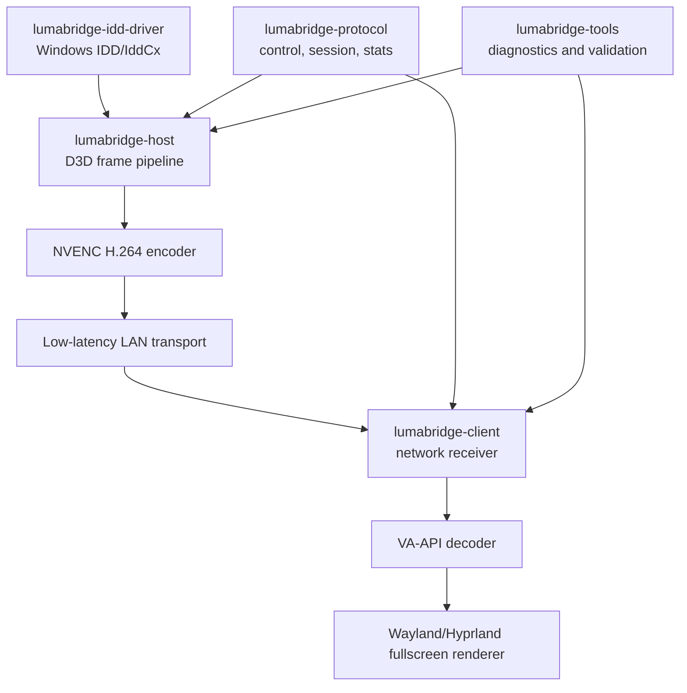

# LumaBridge Display - Plano de Implementacao

## 1. Visao geral

O LumaBridge Display e uma aplicacao multiplataforma para permitir que um dispositivo Linux secundario, inicialmente um laptop com Arch Linux + Hyprland, funcione como monitor secundario real para um PC Windows 11.

O produto nao deve ser tratado como simples espelhamento de tela. O objetivo tecnico central e criar um monitor virtual no Windows por meio do modelo oficial de Indirect Display Driver, permitir que o Windows use esse monitor em modo estendido, capturar/processar os frames desse display virtual, codificar com baixa latencia e transmitir para o cliente Linux em rede local.

Estado local observado nesta etapa:

- Existe `REQUISITOS_LUMABRIDGE.md`.
- Nao existem ainda `docs`, `.github`, `src`, `driver`, `host`, `client` ou estrutura equivalente.
- A pasta local ainda nao esta inicializada como repositorio Git.
- Nenhuma branch local foi detectada porque nao ha `.git`.

Repositorio oficial informado:

- `https://github.com/Altaeir-13/LumaBridge-Display.git`

Este documento organiza o desenvolvimento futuro. Ele nao implementa driver, host, cliente, protocolo, streaming, UI, CI funcional, issues reais ou PRs reais.

## 2. Objetivo do MVP

O MVP sera considerado funcional quando:

- O Windows 11 reconhecer um monitor virtual adicional criado pelo LumaBridge.
- O usuario conseguir usar o modo "Estender estes videos" para esse monitor.
- O usuario conseguir arrastar uma janela para o monitor virtual.
- O host Windows conseguir processar os frames desse monitor virtual.
- O host conseguir codificar os frames com NVENC H.264 ou exibir fallback documentado para diagnostico.
- O cliente Arch Linux + Hyprland conseguir receber, decodificar via VA-API quando disponivel e renderizar em fullscreen.
- A comunicacao funcionar em LAN.
- O sistema exibir metricas basicas de FPS, bitrate, perda, jitter e latencia aproximada.
- Existir documentacao minima de setup, execucao e troubleshooting.

## 3. Escopo do MVP

Incluido no MVP:

- Host Windows 11.
- Driver virtual baseado em Microsoft Indirect Display Driver Model, IddCx, UMDF e WDK.
- Um monitor virtual inicial com modos 720p60, 1080p60 e 1440p60 quando viavel.
- Pipeline grafico inicial em Direct3D 11.
- Encode H.264 por NVENC, priorizando baixa latencia.
- Transporte em LAN, inicialmente UDP/RTP ou QUIC, com descarte de frames atrasados.
- Cliente Linux para Arch Linux + Hyprland.
- Decode preferencial por VA-API com fallback por software apenas para diagnostico.
- Render fullscreen em Wayland/Hyprland.
- Configuracao por arquivo ou CLI.
- Logs estruturados e metricas basicas.
- Pareamento simples em etapa posterior do MVP utilizavel, sem criptografia caseira.

## 4. Fora do escopo do MVP

Fora do MVP:

- NAT traversal, STUN/TURN/ICE e relay pela internet.
- Cliente Android, iOS ou macOS.
- HDR.
- Audio multicanal.
- Multiplos monitores virtuais simultaneos.
- UI sofisticada.
- Instalador assinado para distribuicao publica.
- Driver assinado para producao.
- Compatibilidade com jogos protegidos por anti-cheat.
- Modo colaborativo multiusuario.
- Reverse engineering de Parsec, spacedesk ou qualquer produto proprietario.
- Copia de codigo proprietario.

## 5. Arquitetura em alto nivel

Fluxo principal:

1. O driver IDD cria o monitor virtual no Windows.
2. O Windows renderiza conteudo para esse monitor virtual.
3. O host recebe/processa frames do display virtual.
4. O host converte/prepara frames para NVENC evitando copias GPU -> CPU desnecessarias.
5. O host codifica H.264 em modo de baixa latencia.
6. O host envia pacotes de video e controle pela LAN.
7. O cliente recebe, reordena de forma limitada e descarta frames atrasados.
8. O cliente decodifica via VA-API quando disponivel.
9. O cliente renderiza o conteudo em fullscreen no Hyprland.
10. Ambos os lados reportam logs e metricas.

## 6. Modulos principais

O projeto sera organizado em exatamente 7 modulos logicos:

1. `lumabridge-protocol`: contratos de comunicacao, handshake, sessao, estatisticas, erros e versionamento.
2. `lumabridge-idd-driver`: driver Windows responsavel apenas pelo monitor virtual real.
3. `lumabridge-host`: aplicacao Windows responsavel por frames, encode, transporte, sessao e metricas.
4. `lumabridge-client`: aplicacao Linux responsavel por rede, decode, render fullscreen, latencia e metricas.
5. `lumabridge-tools`: diagnostico, medicao de latencia, validacao de rede, codecs e ambiente.
6. `docs`: arquitetura, ADRs, guias, riscos, planejamento e troubleshooting.
7. `.github`: governanca do repositorio, templates, labels, milestones e workflows futuros.

## 7. Ordem recomendada de implementacao

1. Planejamento e estrutura documental.
2. Templates e governanca do GitHub.
3. CI planejado, sem exigir pipeline completo antes dos spikes.
4. Spikes tecnicos isolados:
   - IddCx cria monitor virtual 1080p60.
   - NVENC codifica frames sinteticos.
   - VA-API decodifica sample H.264 no Arch Linux.
   - Transporte LAN envia frames sinteticos.
5. Fundacao do protocolo.
6. Driver virtual Windows minimo.
7. Host Windows com pipeline de frame sintetico e depois frame real.
8. Cliente Linux com recepcao, decode e render fullscreen.
9. Integracao LAN ponta a ponta.
10. Pareamento e autenticacao de sessao.
11. Metricas e diagnostico.
12. UX minima e empacotamento de desenvolvimento.
13. Otimizacao de latencia/qualidade.
14. Release candidate.

## 8. Dependencias entre modulos

- `lumabridge-protocol` deve existir antes da integracao real entre host e cliente.
- `lumabridge-idd-driver` pode evoluir em paralelo aos spikes de NVENC, VA-API e transporte.
- `lumabridge-host` depende do driver para frames reais, mas deve aceitar frames sinteticos para teste isolado.
- `lumabridge-client` depende do protocolo e do formato de stream, mas deve aceitar streams sinteticos para teste isolado.
- `lumabridge-tools` deve nascer cedo para medir latencia, rede, codecs e ambiente.
- `docs` deve acompanhar qualquer decisao de arquitetura, setup ou protocolo.
- `.github` deve ser preparado antes de abrir PRs reais.

## 9. Riscos tecnicos

- Driver virtual Windows com IddCx e o maior risco tecnico; sem ele o produto vira apenas screen sharing.
- Assinatura e instalacao de driver podem bloquear distribuicao publica.
- Latencia depende de evitar copias CPU/GPU desnecessarias, especialmente GPU -> CPU -> GPU.
- NVENC precisa ser configurado em modo de baixa latencia, com B-frames desativados inicialmente, lookahead desligado e VBV pequeno.
- VA-API pode variar conforme geracao da iGPU Intel, driver e pacotes instalados.
- Hyprland/Wayland exige cuidado para fullscreen, frame pacing, input futuro e sincronizacao.
- TCP puro nao deve ser tratado como solucao final para video interativo de baixa latencia.
- NAT traversal fica fora do MVP para reduzir risco.
- Seguranca deve evitar criptografia caseira; usar QUIC TLS, DTLS ou bibliotecas consolidadas quando criptografia entrar.
- O projeto nao pode se desviar para captura generica da tela principal.

## 10. Estrategia de validacao

Validar em camadas:

- Driver: Windows lista o monitor virtual em Configuracoes > Sistema > Tela.
- Host: frames sinteticos e frames reais sao processados com contador de frames e metricas.
- Encoder: NVENC H.264 inicializa, codifica e reporta erro claro quando indisponivel.
- Transporte: pacotes carregam frame ID, sequencia, timestamp e flags de keyframe.
- Cliente: recebe stream sintetico, decodifica, renderiza e descarta frames atrasados.
- Integracao: janela arrastada para o monitor virtual aparece no laptop Linux.
- Diagnostico: relatorios mostram FPS, bitrate, perda, jitter, encode time, decode time e latencia aproximada.

## 11. Estrategia de testes

Testes automatizados esperados:

- Serializacao e desserializacao do protocolo.
- Rejeicao de versao incompativel.
- Fragmentacao/remontagem de pacotes.
- Reordenacao limitada e descarte de pacotes atrasados.
- Calculo de FPS, bitrate, jitter e perda.
- Carregamento e validacao de configuracao.
- Estado de sessao: idle, pairing, connected, streaming, stopping, error.

Testes manuais obrigatorios:

- Instalar driver em modo de desenvolvimento.
- Confirmar monitor virtual no Windows.
- Confirmar modo estendido.
- Arrastar janela para o monitor virtual.
- Confirmar fullscreen no Hyprland.
- Confirmar decode VA-API quando disponivel.
- Confirmar desconexao sem travar host.
- Confirmar logs e metricas basicas.

## 12. Estrategia de branches

- `main`: preservada para release final funcional. Nao recebera implementacao direta.
- `dev`: branch de integracao durante desenvolvimento.
- `feature/*`: funcionalidades pequenas e revisaveis.
- `fix/*`: correcoes.
- `spike/*`: validacoes tecnicas isoladas e potencialmente descartaveis.
- `docs/*`: documentacao e governanca.
- `infra/*`: CI, templates, build e estrutura de repositorio.
- `release/*`: estabilizacao antes de merge final em `main`.

Nesta etapa de planejamento:

- Nao e necessario criar `dev`.
- Nao e necessario fazer push.
- Nao e necessario abrir PR.
- Nao deve haver commit automatico.

## 13. Estrategia de Pull Requests

Todo PR futuro deve:

- Ter uma issue associada.
- Ter base em `dev`, exceto PR final de release para `main`.
- Ser pequeno e revisavel.
- Conter objetivo, escopo, testes, riscos e evidencias.
- Usar Conventional Commits.
- Atualizar documentacao quando alterar arquitetura, setup, protocolo ou comportamento.

## 14. Definicao de pronto para issue

Uma issue so deve ser considerada pronta quando:

- Entrega verificavel foi implementada ou documentada.
- Criterios de aceite foram atendidos.
- Testes relevantes foram executados ou justificadamente marcados como nao aplicaveis.
- Logs, screenshots ou metricas foram anexados quando aplicavel.
- Documentacao foi atualizada quando necessario.
- Nenhum escopo de outro modulo foi misturado indevidamente.

## 15. Definicao de pronto para Pull Request

Um PR so deve ser considerado pronto quando:

- Tem issue relacionada.
- Compila ou documenta claramente por que build nao se aplica.
- Testes automatizados relevantes passam.
- Testes manuais obrigatorios foram registrados.
- Riscos conhecidos estao descritos.
- Nao inclui alteracoes fora do escopo.
- Nao altera `main` diretamente.
- Foi revisado antes do merge em `dev`.

## 16. Definicao de pronto para MVP

O MVP estara pronto quando:

- O driver IDD cria um monitor virtual reconhecido pelo Windows 11.
- O modo estendido funciona.
- O host transmite conteudo real do monitor virtual em LAN.
- O cliente Linux exibe o monitor virtual em fullscreen no Hyprland.
- O stream roda em 1920x1080@60fps em condicoes boas de LAN.
- O host usa NVENC H.264.
- O cliente usa VA-API quando disponivel.
- Existem metricas basicas de FPS, bitrate, perda, jitter e latencia.
- Existem guias minimos de setup para Windows host e Arch Linux client.
- O fluxo de trabalho com `dev`, PRs, issues e Conventional Commits esta documentado.
